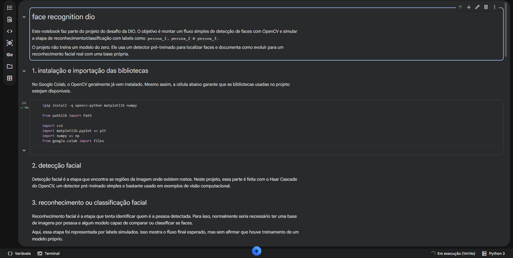
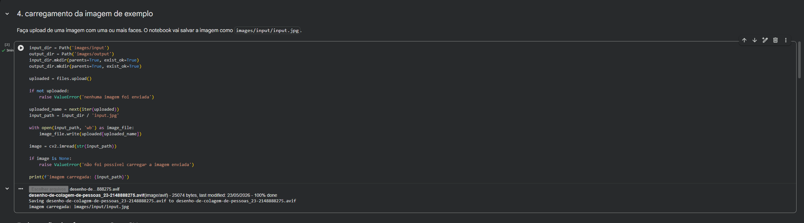
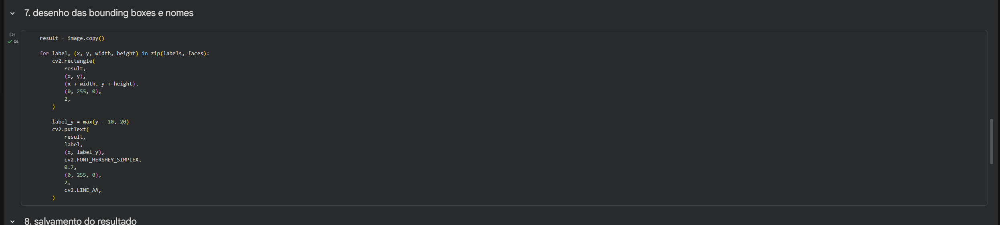
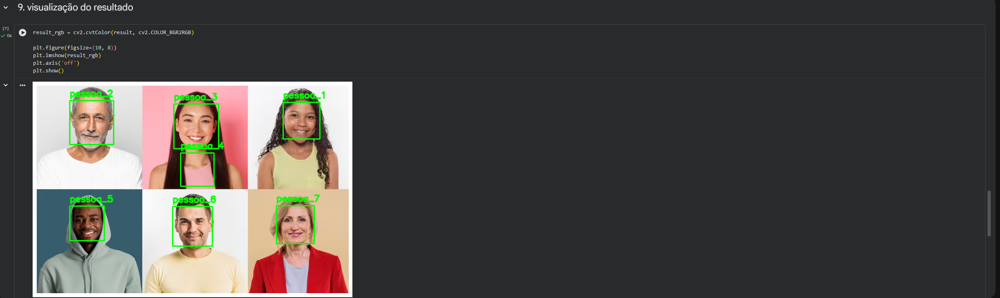

# face recognition dio

esse projeto foi desenvolvido como desafio prático da dio para montar um fluxo simples de detecção e reconhecimento facial utilizando python e opencv.

a ideia foi trabalhar com uma imagem enviada no google colab, detectar os rostos usando haar cascade e desenhar as bounding boxes no resultado final. a parte de reconhecimento foi simulada com labels como `pessoa_1`, `pessoa_2` e assim por diante, só para representar o fluxo completo sem afirmar que houve treino real de um modelo.

## objetivo

detectar faces em uma imagem, desenhar retângulos ao redor dos rostos encontrados e adicionar labels simulados para representar uma etapa simples de classificação.

o foco do projeto foi demonstrar o caminho básico:

```text
carregar imagem -> detectar faces -> desenhar bounding boxes -> exibir resultado
```

## tecnologias usadas

- python
- opencv
- numpy
- matplotlib
- google colab

## como funciona

o projeto usa o haar cascade do opencv, um classificador pré-treinado bastante usado em exemplos de detecção facial.

ele identifica regiões da imagem que parecem conter rostos. depois disso, o código desenha uma bounding box em cada face detectada e adiciona um texto simples acima dela.

os nomes `pessoa_1`, `pessoa_2`, `pessoa_3` etc são labels simulados. eles não representam uma identificação real da pessoa, porque este projeto não treina um modelo próprio de reconhecimento facial.

## prints do projeto

### notebook no google colab



### carregamento da imagem



### desenho das bounding boxes



### resultado final



## estrutura do projeto

```text
face-recognition-dio/
├── README.md
├── README-assets/
│   ├── notebook_overview.png
│   ├── image_upload.png
│   ├── bounding_boxes.png
│   └── final_result.png
├── requirements.txt
├── notebooks/
│   └── face_recognition_colab.ipynb
├── src/
│   └── main.py
├── images/
│   ├── input/
│   ├── output/
│   └── README.md
├── dataset/
│   └── README.md
└── docs/
    └── entrega_dio.md
```

## como rodar no colab

1. abra o arquivo `notebooks/face_recognition_colab.ipynb` no google colab.
2. execute as células na ordem.
3. faça upload de uma imagem quando o notebook pedir.
4. acompanhe a detecção das faces e o desenho das bounding boxes.

## como rodar localmente

crie um ambiente virtual, instale as dependências e execute o script:

```bash
python -m venv .venv
.venv\Scripts\activate
pip install -r requirements.txt
python src/main.py
```

antes de executar localmente, coloque uma imagem em:

```text
images/input/input.jpg
```

o resultado processado é salvo em:

```text
images/output/face_detection_result.jpg
```

## resultado esperado

ao final, o projeto gera uma imagem com:

- faces detectadas pelo haar cascade
- bounding boxes desenhadas ao redor dos rostos
- labels simulados acima de cada face
- imagem final salva na pasta de saída

## aprendizados

durante o desenvolvimento, os principais aprendizados foram:

- uso básico do opencv em um fluxo de visão computacional
- diferença entre detectar um rosto e reconhecer uma pessoa
- aplicação de haar cascade para detecção facial
- desenho de bounding boxes e textos sobre uma imagem
- simulação de classificação com labels simples
- organização de um projeto pequeno de visão computacional com notebook, script e imagens

## observações

este projeto não faz reconhecimento facial real com treino de ia.

a detecção facial foi feita com um modelo pré-treinado do opencv. a parte de reconhecimento foi representada de forma simples usando labels automáticos, porque o objetivo aqui era mostrar o fluxo completo de detecção + reconhecimento facial de uma forma inicial e prática.

para evoluir o projeto, um próximo passo seria montar um dataset próprio, separar imagens por pessoa e testar uma abordagem real de classificação ou embeddings faciais.
